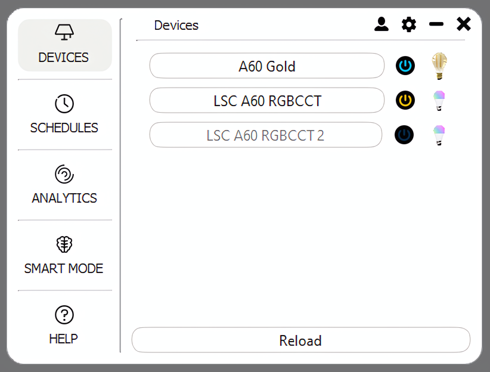

# Aurora

Windows system tray application to control Tuya light bulbs.

## Overview
This application can start at Windows startup and work in the background. You can access it anytime from the Windows system tray. The window is tiny and comfortable to use while doing anything on your computer.

## Features
Available functionalities may change due to the capabilities of the particular devices, but in general, the application offers the following features:
- Device control (switch, change brightness, temperature, colour, set up a countdown)
- Schedules
- Analytics (usage of devices in last days)
- Smart mode (learning from user's previous interactions and calculating new schedules to automate device control)
- Help (you can find answers to most important questions regarding the application)
- Profile (where you can inspect and change your Tuya credentials)
- Settings (where you can enable/disable smart mode)

## Setup
To use Aurora, you need to have a cloud development project on the Tuya platform and devices connected to it. Follow this <a href="https://developer.tuya.com/en/docs/iot/user-manual-for-tuya-smart-v3177?id=K9obrofrfk4sk
">guide</a> to use the Tuya Smart or Smart Life app and connect devices to it and this <a href="https://github.com/jasonacox/tinytuya/files/12836816/Tuya.IoT.API.Setup.v2.pdf">guide</a> to set up a cloud development project and bind devices from the app.

## Libraries
- PyQt6
- tinytuya
- Prophet

## Release
- exe binaries created with pyinstaller
- Windows installer created with Inno Setup
The program is automatically registered for Windows startup at installation.

## Windows defender
Since the .exe release of the program isn't signed, Windows Defender may throw a false positive when trying to run this app. If you are concerned, please build the application directly from the source.

## Disclaimer
This project is a subject of my bachelor thesis, yet it is a fully functional program. You can use it freely to control Tuya lightning devices in your home.

## Credits
- Devices navigation bar icon by Phosphor Icons on <a href="https://www.iconfinder.com/icons/9025776/lamp_icon">Iconfinder</a>
- Schedules navigation bar icon by <a href="https://www.iconfinder.com/Enesdal">Enes Dal</a> on <a href="https://www.iconfinder.com/icons/392529/alarm_alert_clock_event_history_schedule_time_watch_icon">Iconfinder</a>
- Analytics navigation bar icon by <a href="https://www.iconfinder.com/justicon">Just Icon</a> on <a href="https://www.iconfinder.com/icons/2672700/line_chart_app_object_essential_ux_icon">Iconfinder</a>
- Smart mode navigation bar icon by <a href="https://www.iconfinder.com/edwinp99">edwin PM</a> on <a href="https://www.iconfinder.com/icons/5041099/brain_health_healthcare_iq_medic_medical_smart_icon">Iconfinder</a>
- Help navigation bar icon by <a href="https://www.iconfinder.com/carbon-design">Carbon Design</a> on <a href="https://www.iconfinder.com/icons/9044348/help_icon">Iconfinder</a>
- Profile action bar icon by <a href="https://www.iconfinder.com/Kh.Artyom">Artyom Khamitov</a> on <a href="https://www.iconfinder.com/icons/1564534/customer_man_user_account_profile_icon">Iconfinder</a>
- Settings action bar icon by Google on <a href="https://www.iconfinder.com/icons/326699/settings_icon">Iconfinder</a>
- Minimize action bar icon by Ionicons on  <a href="https://www.iconfinder.com/icons/211863/minus_round_icon">Iconfinder</a>
- Exit icon by Chunk Icons on <a href="https://www.iconfinder.com/icons/8723144/x_icon">Iconfinder</a>
- Error device icon placeholder by Iconshock on <a href="https://www.iconfinder.com/icons/43694/bulb_icon">Iconfinder</a>
- ON/OFF icon by <a href="https://www.iconfinder.com/bogdanrosu">Bogdan Rosu Creative</a> on <a href="https://www.iconfinder.com/icons/353434/power_switch_off_on_icon">Iconfinder</a>
- Bulb icons by <a href="https://www.freepik.com/author/starline">Starline</a> on <a href="https://www.freepik.com/free-vector/set-three-light-bulb-represent-effective-business-idea-concept_37588597.htm#query=light%20bulb&position=0&from_view=keyword&track=ais&uuid=f3b782a6-85ae-419f-ace8-be389901e5f4">Freepik</a>
- Arrow up icon by Google on <a href="https://www.iconfinder.com/icons/352023/arrow_drop_up_icon">Iconfinder</a>
- Arrow down icon by Google on <a href="https://www.iconfinder.com/icons/352021/arrow_drop_down_icon">Iconfinder</a>
- Schedule ON/OFF icon by <a href="https://www.iconfinder.com/becris">Becris .</a> on <a href="https://www.iconfinder.com/icons/2205230/botton_left_off_on_icon">Iconfinder</a>
- Schedule edit icon by Feather Icons on <a href="https://www.iconfinder.com/icons/8666681/edit_icon">Iconfinder</a>
- Analytics select all icon by Microsoft on <a href="https://www.iconfinder.com/icons/8673728/ic_fluent_select_all_off_filled_icon">Iconfinder</a>
- Analytics deselect all by Microsoft on <a href="https://www.iconfinder.com/icons/8675434/ic_fluent_select_all_off_regular_icon">Iconfinder</a>
- App icon created with DALLE-3
